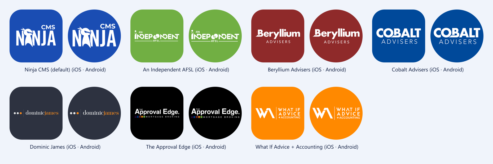

# 08 — App Icons (per-org home-screen icon)

Built 2026-10-02.

> **What:** the phone's **home-screen icon** follows the organisation (**iOS only since 2026-10-06; Android keeps the default, see §6**): **the org's own brand logo on the
> org's colour** (`"style": "brand"`, since 2026-10-02 — trial, may be reverted), or the white CMS NINJA
> wordmark on the org's colour (`"style": "ninja"`). Default (signed out / no org) = wordmark on Ninja CMS blue. After sign-in it switches to the active
> org's icon, and on sign-out it goes back to the default.

## 1. The icons (generated in code)

### Style switch (reversible)

`src/constants/app-icons.json` → `"style"`:
- `"brand"` (current) — each org's brand logo (`logoUrl`, from CMS `Advice.logo`) on its colour.
- `"ninja"` — the CMS NINJA wordmark on its colour (the first version).

**To revert to the wordmark:** set `"style": "ninja"` → `node scripts/generate-app-icons.mjs` →
`npx expo prebuild --clean` → rebuild. (Or `git revert` the brand-logo commit.)

Brand logos: `node scripts/fetch-brand-logos.mjs` downloads each `logoUrl` (use the **original S3 URL**,
not the web's `/_next/image?…&w=256` resize) → trims, caps at 1600px wide → `assets/brand-logos/<name>.png`
(committed). Dominic James + The Approval Edge logos keep their colours (orange "james", colour bars);
the Android monochrome icon is a white silhouette of the logo.

Brand-logo sizing (rev 2): **fitted to each logo's own aspect ratio** — as large as fits 84%×50% of the iOS
icon; on Android 66%×40% with the logo's **diagonal inside a 62% circle** (safe zone minus margin), so no
launcher mask clips it. Very wide logos (Dominic James 6:1, Approval Edge 5:1) are width-limited — to go
bigger they'd need a cropped mark (e.g. the dots / "WA") instead of the full logo.



| Name | Org | Colour |
|---|---|---|
| *(default)* | Ninja CMS (signed out / no org / no match) | `#1A4DB3` (login-page blue) |
| `Independent` | An Independent AFSL | `#71AF43` |
| `Beryllium` | Beryllium Advisers | `#8F2A2A` |
| `Cobalt` | Cobalt Advisers | `#00499A` |
| `DominicJames` | Dominic James | `#2D3240` |
| `ApprovalEdge` | The Approval Edge | `#000000` |
| `WhatIf` | What If Advice + Accounting | `#FF8900` |

The colours were sampled from the web org picker (the card background is `Advice.colorTheme`).

**One source of truth:** `src/constants/app-icons.json`. It's read by:

| Reader | Does |
|---|---|
| `scripts/generate-app-icons.mjs` | renders the PNGs with sharp → `assets/app-icons/` |
| `app.config.ts` | registers the alternates with `expo-alternate-app-icons` (on top of `app.json`) |
| `src/lib/app-icon.ts` | picks the icon for the active org at runtime |

**Generated files** (`node scripts/generate-app-icons.mjs`, committed):

| File | Use |
|---|---|
| `<Name>.png` (1024², opaque) | iOS icon. `Default.png` is the main app icon (`app.json` `icon`). |
| `<Name>-foreground.png` / `<Name>-monochrome.png` | Android adaptive foreground + themed (Android 13+) icon per alternate |
| `adaptive-foreground.png` / `monochrome.png` | the same for the default icon (`app.json`) |
| `favicon.png` | web |
| `preview.png` | contact sheet: iOS rounded square + Android circle crop per icon |

Sizing: the wordmark is 76% wide on iOS (rounded-square mask) and 56% on the Android foreground. These match
Ninja CRM / PRM (measured: 0.75–0.76 iOS, 0.52–0.56 Android), so the apps look alike side by side on a home
screen. Android stays inside the 66% adaptive-icon safe zone under any launcher mask. (Was 62% / 52% until
2026-10-06, which looked visibly smaller next to the other Ninja apps.)

This also **replaced the Expo template art**: the app icon, adaptive icon, favicon, and the splash (now the
CMS NINJA wordmark on navy `#0B2D6F`, 180dp).

## 2. Which icon an org gets

Native apps can't paint a new icon at runtime; every alternate is baked in at build time. So
`appIconForColor(org.colorTheme)` picks the **nearest preset by RGB distance**:
- within **48** → that preset (absorbs small CMS tweaks, e.g. `#6DAE43` → Independent, entity
  `#6B1424` → Beryllium)
- closer to the default blue than to any alternate, too far from all of them, or no/invalid colour → **default**

Checked 2026-10-02: Cobalt's entity navy `#0B2D6F` → default; CLS grey `#8A8585` → default; pale colours →
default. ⚠️ The AIAFSL navy `#1E3A5F` → `DominicJames` (nearest dark preset, distance 35). Add an AIAFSL preset
if it needs its own icon.

**A new org that needs its own icon:** add `{ name, label, color }` to `app-icons.json` → run the generator →
**rebuild the app** (dev client / store build). Without a rebuild, the org gets the nearest existing icon.

## 3. When it switches (`src/hooks/use-org-app-icon.ts`, mounted in the root layout)

| State | Icon |
|---|---|
| signed out, booting, no org chosen yet | default |
| signed in + active org | that org's icon |
| switch org | the new org's icon |

- **iOS:** switches immediately. iOS shows its own one-line alert ("You have changed the icon for Ninja
  CMS"). That's the OS and can't be suppressed.
- **Android:** switches **when the app next goes to the background**. The library disables the launcher alias
  the app is running under (`MainActivity` → `MainActivityBeryllium`). Doing that in the foreground can
  close the app on some launchers, and the library needs the activity to still exist (`currentActivity!!`),
  which it does at the background transition. Some launchers take a few seconds to redraw.
- It never switches during cold start before the stored session has loaded, so the icon doesn't flicker.
- Every call is wrapped in try/catch. The icon is cosmetic and must never break the app.

## 4. ⚠️ Needs a development build

`expo-alternate-app-icons` is a **native** module. **It is not in Expo Go.** In Expo Go and on web,
`canChangeAppIcon()` is false and everything is a no-op; the app works normally with the default icon.
To see the icons switch:

**Test on a Mac in the iOS Simulator** (alternate icons work there — Apple's `setAlternateIconName`):

```bash
# one-time: Xcode (from the App Store) + its command-line tools, CocoaPods (`brew install cocoapods`)
npm install
npm run ios:dev          # = npx expo run:ios → prebuilds ios/, pod install, builds, installs on the Simulator, starts Metro
```

Then: sign in → pick an org → press **Cmd+Shift+H** (Home) and the icon has changed (iOS also showed its
"You have changed the icon…" alert). Sign out → back to blue. Next time just run `npx expo start` and open
the installed **Ninja CMS** app (not Expo Go) — rebuild with `npm run ios:dev` only when native config
changes (e.g. `app-icons.json`).

⚠️ `npx expo start` → `i` / Expo Go **can't** switch icons. With `expo-dev-client` installed, `expo start`
targets the dev build by default; press **`s`** in the Metro terminal to switch to Expo Go for quick UI work.

**Diagnose from the Metro log** (dev only): every change prints
`[app-icon] org=Beryllium Advisers colour=#8F2A2A → icon=Beryllium` — and `NOT APPLIED: no native module`
when running in Expo Go. `icon=Default` for a real org means its colour isn't close to any preset (§2).

Android: `npm run android:dev` (needs Android Studio / SDK), or EAS (no local SDK):
`npx eas-cli@latest build -p android --profile development` once eas.json exists.

Verified 2026-10-02 with `npx expo prebuild` (then deleted the generated `android/`): 6 `activity-alias`
entries (`.MainActivityIndependent` … `.MainActivityWhatIf`) + adaptive/monochrome mipmaps for each.
(iOS prebuild doesn't run on Windows. The iOS config is generated by the same plugin at EAS build time.)
⚠️ **Not yet seen switching on a device.**

## 5. Gotchas

- ⚠️ **Stale native project (hit 2026-10-02 on the Mac):** `npx expo run:ios` only generates `ios/` if it
  doesn't exist. An `ios/` from before the icon work keeps the **Expo template icon** and has **no
  `expo-alternate-app-icons` pod**, so the dev build logs `NOT APPLIED: native module unavailable (…)` even
  though it isn't Expo Go. Fix: `npx expo prebuild --clean --platform ios` → `npx expo run:ios`
  (Android: `--platform android`). Do this after **any** change to `app.json` / `app.config.ts` /
  `app-icons.json` / native packages. `ios/` and `android/` are git-ignored (CNG), so `--clean` is safe.
- The simulator caches home-screen icons; if the old icon lingers after a clean build, delete the app
  from the simulator (long-press → Remove App) and run again.

- `npx expo prebuild` rewrites the `android`/`ios` scripts in `package.json` to `expo run:*`. It was
  reverted. Check `git diff package.json` after any prebuild.
- The library generates a TypeScript union of icon names only at prebuild, so `setAppIcon` casts the
  name. Names always come from `app-icons.json`.
- Changing the shared wordmark (`assets/images/ninja-cms-logo.png`) → re-run the generator.

## 6. Android: per-org icons via our own launcher aliases (back on 2026-10-07)

**History, 2026-10-06:** after the icon switched on Android, `expo run:android` / the dev client failed with *"Unable
to find explicit activity class com.adviceninja.ninjacms/.MainActivity…"*. expo-alternate-app-icons keeps the
LAUNCHER on the real `.MainActivity` and switches by calling `setComponentEnabledSetting(.MainActivity, DISABLED)`.
That **disables the app's real activity**, and the state survives reinstalls. Android was set to default-only.

**Now (2026-10-07):** per-org icons work on Android again, with a design that never disables `.MainActivity`:

| Component | Launcher entry | Deep links | Enabled |
|---|---|---|---|
| `.MainActivity` (real activity) | ❌ removed | ✅ | always; never touched |
| `.MainActivityDefault` (alias, default icon) | ✅ | ❌ | yes, unless an org icon is on |
| `.MainActivity<Name>` (alias per org icon) | ✅ | ❌ (stripped) | only when it is that org's icon |

- **`plugins/with-android-icon-aliases.js`** (config plugin) reshapes the manifest: it strips LAUNCHER from `.MainActivity`,
  adds `.MainActivityDefault`, and reduces the library's aliases to a launcher filter only. Without that, an enabled alias plus
  `.MainActivity` would both match deep links and show an "open with" chooser. ⚠️ It must be listed **before**
  `expo-alternate-app-icons` in `app.config.ts`: manifest mods run in reverse order. Verified with
  `npx expo prebuild --platform android` on 2026-10-07.
- **`modules/ninja-app-icon`** (local Expo module, Android only, autolinked from `modules/`): `setIcon(name, names)`
  enables the target alias first (so there's always a launcher entry), then disables the other aliases. `getIcon` reads
  the enabled alias. On start it re-enables `.MainActivity` if an older build disabled it.
- The library still does the iOS switching and generates the Android mipmaps. Only its Android **switch** is unused.
- `expo run:android` launches the alias's target (`.MainActivity`, always enabled + exported), so dev launches are safe.
- **When:** iOS switches at once. Android switches when the app goes to the **background** (sign in → leave the app
  → the icon changes), because changing a running app's launcher alias can close it on some launchers. Some launchers
  take a few seconds to refresh. A home-screen shortcut pinned to the old alias may disappear; re-add it from the app drawer.

**A phone still stuck from the old build** ("Unable to find explicit activity class"): `adb uninstall
com.adviceninja.ninjacms`, then `npx expo run:android`.
